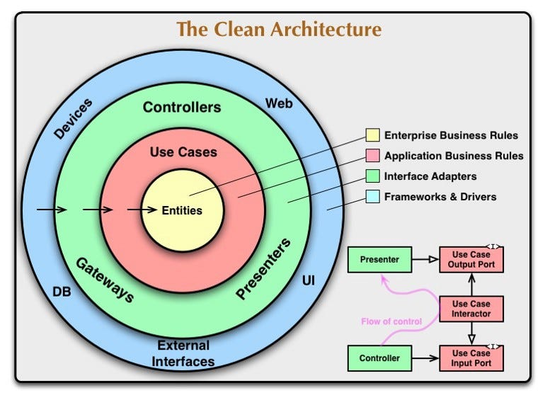

# RecargaPay Wallet

## Wallet API

### What should be done?
Wallet service that manages users' money. This service will support
operations for depositing, withdrawing, and transferring funds between users.

### Functional Requirements
- **Create Wallet:** Allow the creation of wallets for users.
- **Retrieve Balance:** Retrieve the current balance of a user's wallet.
- **Retrieve Historical Balance:** Retrieve the balance of a user's wallet at a specific
point in the past.
- **Deposit Funds:** Enable users to deposit money into their wallets.
- **Withdraw Funds:** Enable users to withdraw money from their wallets.
- **Transfer Funds:** Facilitate the transfer of money between user wallets.

### Non-functional requirements
- This service is mission-critical. Any downtime would significantly impair the platform's ability to
- perform most operations.
- Given that the service handles monetary transactions, it is imperative to ensure full traceability of
all operations to facilitate auditing of wallet balances.  

## Installation Instructions
### Prerequisites
- **Java 21**
- **Maven 3.9.2**
- **Docker**
- **PostgreSQL 17.6**

### Installation Steps - WINDOWS
1. **Install Java 21+**
   - Download and install Java 21 from the official Oracle website:
     - [Java 21 Downloads](https://www.oracle.com/br/java/technologies/downloads/#java21)
     - Ensure that the `JAVA_HOME` environment variable is set to the Java installation directory.
     - Verify the installation by running:
            java -version
2. **Install Maven 3.9.2**
   - Download and install Maven 3.9.2 from the official Apache Maven website:
     - [Maven Downloads](https://maven.apache.org/download.cgi)
     - Ensure that the `MAVEN_HOME` environment variable is set to the Maven installation directory.
     - Verify the installation by running:
            mvn -version
3. **Install Docker**
    - Download and install Docker Desktop from the official Docker website:
      - [Docker Desktop Downloads](https://www.docker.com/products/docker-desktop)
      - Follow the installation instructions for your operating system.
      - Verify the installation by running:
                docker --version
4. **Install PostgreSQL 17.6**
    - Download and install PostgreSQL 17.6 from the official PostgreSQL website:
      - [PostgreSQL Downloads](https://www.postgresql.org/download/)
      - Follow the installation instructions for your operating system.
      - Ensure that the PostgreSQL server is running and accessible.
      - Verify the installation by running:
                psql --version

### How to Run the application locally
1. **Clone the Repository**
    - Clone the repository to your local machine using:
      - https://github.com/avastt/recargapay-wallet.git
2. **Build the Project**
   - Navigate to the project directory and run:
            mvn clean install
3. **Start your Docker Desktop**
    - `run docker-compose up -d` into project directory.
    - This will start the **PostgreSQL** database and **PgAdmin(http://localhost:8081/)** in a Docker container.
      - Create a new server in PgAdmin with the following details (as set in the `docker-compose.yml` file):
        - login.email: user@localhost.com
        - login.password: password
        - port: `5432`
        - postgres.username: `walletuser`
        - postgres.password: `walletpass`
4. **Run the Application**
   - The application will be accessible at `http://localhost:8080`.
   - Swagger at http://localhost:8080/swagger-ui/index.html#/

### Architecture Decision and Design
- **Clean Architecture**
  - promotes the separation of concerns within an application, making it more maintainable, testable, and adaptable to changes;

  - **Layers**:
    - **Controller Layer**: Handles HTTP requests and responses;
    - **Usecases Layer**: Contains business logic and orchestrates operations;
    - **Domain layer**: Defines core entities and business rules;
    - **Repository Layer**: Manages data access and persistence;
    - **Requests/responses Layer**: Defines data transfer objects (DTOs) for communication between layers;

### Techs Stack
- **Java 21**: Commonly used LTS version;
- **Spring Boot 3.2.0**: Open-source, using Spring Framework in Java is designed to simplify and accelerate the development of Spring applications;
- **Maven**: Dependency management and build tool;
- **PostgresDB**: Relational database for ACID compliance;

### Others features
- **Spring-data**: JPARepository to simplify database interactions;
- **Spring-retry**: To implement retry logic when some exception is thrown;
- **Lombok**: To reduce boilerplate code;
- **Swagger/OpenAPI v3**: For API documentation and testing;
- **JUnit5 + Mockito**: For unit tests;
- **Race conditions lock**: To handle concurrency and ensure data integrity during transactions;
- **Docker**: Containerization for easy deployment;

### To Be Improved
- Security Layer with: JWT authentication;
- CI/CD pratices;
- Redis caching layer;
- More tests like Container tests;
